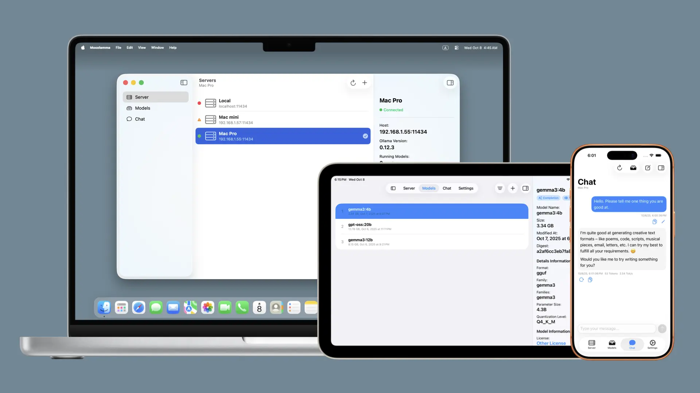
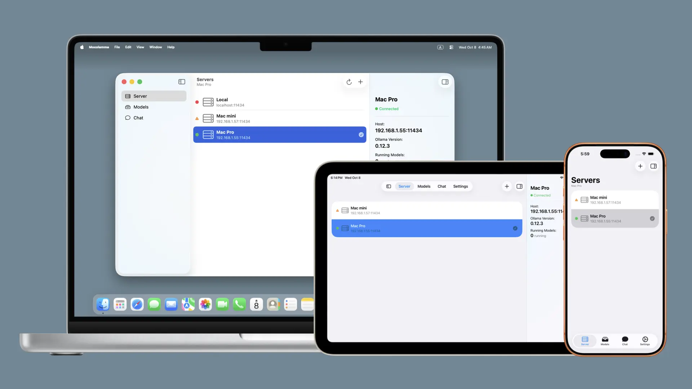
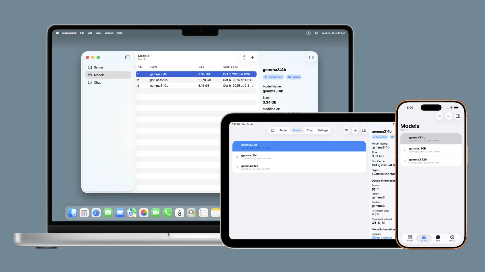
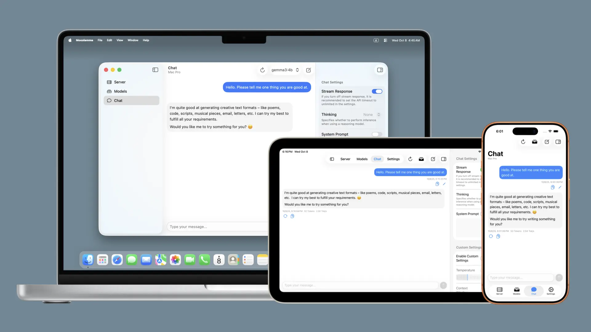

# Mocolamma
**English** | [日本語](/docs/README-ja.md)

  
  &nbsp;
  
  &nbsp;
  

  

## Table of Contents
- [What is Mocolamma?](#what-is-mocolamma)
  - [Origin of the name](#origin-of-the-name)
  - [Download](#download)
    - [macOS Version](#macos-version)
    - [iOS / iPadOS Version](#ios--ipados-version)
  - [System Requirements](#system-requirements)
  - [Differences between free and paid versions](#differences-between-free-and-paid-versions)
- [Features](#features)
  - [Server Tab](#server-tab)
  - [Model Tab](#model-tab)
  - [Chat Tab](#chat-tab)
  - [Privacy and Security](#privacy-and-security)
- [Support and Feedback](#support-and-feedback)
  - [Bug Reports](#bug-reports)
  - [Feedback](#feedback)
  - [Community](#community)
- [Support Developer](#support-developer)
  - [Give a Star](#give-a-star)
  - [Donate](#donate)
- [Credits](#credits)
  - [Ollama by Ollama](#ollama-by-ollama)
  - [Gemini CLI by Google / Qwen Code by Qwen / opencode by SST](#gemini-cli-by-google--qwen-code-by-qwen--opencode-by-sst)
  - [MarkdownUI by Guillermo Gonzalez](#markdownui-by-guillermo-gonzalez)
  - [CompactSlider by Alexey Bukhtin](#compactslider-by-alexey-bukhtin)
  - [create-dmg by Andrey Tarantsov and Andrew Janke](#create-dmg-by-andrey-tarantsov-and-andrew-janke)

## What is Mocolamma?

Mocolamma is an Ollama management application for macOS and iOS / iPadOS that connects to Ollama servers to manage models and perform chat tests using models stored on the Ollama server.

> [!NOTE]
> Generative AI was used in the development of Mocolamma. Therefore, the code might not follow best practices or may contain unstable code.

### Origin of the name
The name "Mocolamma" is a coined word combining "**Mo**del", "**Co**ntrol", "Ol**lam**a", and "**Ma**nage".\
I wanted it to be easy to read and remember, while having a meaningful name, so this word came to be.

### Download
#### macOS Version
Mocolamma can be downloaded for free from the [**releases page**](https://github.com/taikun114/Mocolamma/releases/latest), or purchased for $2.99 on the Mac App Store (App Store link is coming soon).

#### iOS / iPadOS Version
Mocolamma can be purchased for $0.99 on the App Store (App Store link is coming soon). Due to iOS / iPadOS / visionOS restrictions that prevent free installation from external sources, this pricing model is necessary.

> [!NOTE]
> App Store prices may vary by country and could be automatically adjusted due to exchange rates. These prices are based on the Japanese yen prices of 500 yen for macOS and 120 yen for iOS / iPadOS / visionOS, but actual prices may differ depending on your region.

### System Requirements
Mocolamma supports **Intel-based Macs** and **Apple Silicon Macs** running **macOS Sonoma (14.0) or later**, and **iPhones and iPads** running **iOS / iPadOS 17.0 or later**, as well as **Apple Vision Pro** running **visionOS 2.0 or later** as an iPad app.

> [!NOTE]
> I do not own an Apple Vision Pro, and have only tested on the simulator without real device testing, so there's a possibility of unintended behavior on visionOS.\
> In my development environment, despite having the visionOS 1.X simulator installed and properly configured, it doesn't appear in the simulator device list, so I can't confirm if Mocolamma works on visionOS 1.X.\
> Mocolamma's development settings should support visionOS 1.X as well, so I believe Mocolamma can be installed on visionOS 1.X, but since I haven't been able to test on the simulator, even if installation is successful, there's a possibility it may not work correctly.

### Differences between free and paid versions
Mocolamma has both a free version (GitHub version) and a paid version (App Store version), but both have almost identical functionality. **The only difference is the availability of automatic updates.**\
The paid version can automatically update and install using App Store functionality, while the free version currently lacks update check and installation features (meaning the app's functionality is entirely unchanged!).

I would appreciate it if you purchase from the App Store, but feel free to download for free first, and if you find it very useful, please consider purchasing or [**donating**](#donate)! 

## Features
Mocolamma can connect to Ollama servers on local or external networks to manage models and perform simple chats using the models.

### Server Tab

From the server tab, you can easily manage Ollama servers by adding, editing, and more. By default, the localhost server is registered on macOS, so if you're running the Ollama server on the Mac where you opened Mocolamma, you can start using it immediately without additional server setup.

### Model Tab

From the model tab, you can view models stored on the selected server and add models to the selected server. By opening the inspector, you can check specific model details as well.

### Chat Tab

The chat tab allows you to have simple chats using models stored on the selected server. This is merely a simple chat usable for model testing, so it doesn't have message saving functionality or detailed parameter settings, but it's convenient for casually testing downloaded models.\
For advanced chat features, I recommend using the official Ollama app or specialized chat-focused applications.

### Privacy and Security
Mocolamma **does not collect any information about users**.\
Usage data and crash reports of users who have enabled "Share with App Developers" in the system settings "Analytics & Improvements" may be shared, but **the app itself doesn't have any functionality to collect and send information**. You can安心 use it even if you're concerned about privacy.

## Support and Feedback
### Bug Reports
Mocolamma is an app developed using generative AI. Although extensive testing was performed during development, bugs may remain, or some functions may not work properly.

If you find bugs or operational issues, please check the already opened [**Issues**](https://github.com/taikun114/Mocolamma/issues) (known bugs or issues) and look for the same problems already reported by others. If you can't find the same issue, please open a new Issue to report the problem.\
To make bug tracking easier, please open one Issue per issue if you want to report multiple issues. In other words, if you want to report two bugs, you need to open two Issues.

### Feedback
If you want to submit bug reports, idea sharing, or messages to the developer (me) as someone without a GitHub account, please click [**this link**](mailto:contact.taikun@gmail.com?subject=Mocolamma%20Feedback%3A%20&body=Please%20describe%20the%20feedback%20in%20detail%3A%0D%0A%0D%0ASystem%20Information%3A%0D%0A%0D%0A-%20System%0D%0APlease%20enter%20the%20model%20of%20your%20Mac%20%2F%20iPhone%20%2F%20iPad%20%2F%20Apple%20Vision%20Pro.%0D%0A%0D%0A-%20OS%20Version%0D%0AIf%20you%20are%20experiencing%20problems%2C%20please%20enter%20the%20version%20of%20macOS%20%2F%20iOS%20%2F%20iPadOS%20%2F%20visionOS%20on%20which%20Mocolamma%20is%20running.%0D%0A%0D%0A-%20App%20Version%0D%0AIf%20you%20are%20experiencing%20problems%2C%20please%20enter%20the%20version%20of%20the%20app.%0D%0A%0D%0A) or send an email through the "Send Feedback" button on the about screen (accessed from "About Mocolamma" on macOS, or from the information button in the settings tab on iOS / iPadOS / visionOS) (please note that I may not be able to reply to all messages).\
Opening the email sending screen from the in-app button will pre-fill necessary information such as system information (model ID, CPU architecture type, OS version information) and app version information, so I recommend sending from there.

### Community
A [**Discussions page**](https://github.com/taikun114/Mocolamma/discussions) is available where you can share new features you'd like added to the app, ask questions about potential issues, or exchange opinions with others.\
Please make good use of it as a place for information exchange. I often look at it too, so messages to the developer are welcome!

## Support Developer
### Give a Star
Please click the "Star" button in the upper right corner at [**this page**](https://github.com/taikun114/Mocolamma) to give it a star!\
This button is like a thumbs up button and keeps me motivated to continue development! This feature is free, so please give it a star if you like Mocolamma!

### Donate
If you like Mocolamma, please donate to support continued development!

You can donate using the following services.

#### Buy Me a Coffee
Support from the cost of a cup of green tea at [**Buy Me a Coffee**](https://www.buymeacoffee.com/i_am_taikun).

#### PayPal.Me
If you have a PayPal account, you can donate directly through [**PayPal**](https://paypal.me/taikun114).

## Credits
### [Ollama](https://github.com/ollama/ollama) by Ollama
Mocolamma is an app specialized in managing and operating Ollama servers and models. Without Ollama, Mocolamma would not have emerged.

### [Gemini CLI](https://github.com/google-gemini/gemini-cli) by Google / [Qwen Code](https://github.com/QwenLM/qwen-code) by Qwen / [opencode](https://github.com/sst/opencode) by SST
These excellent generative AI tools were used in the development of Mocolamma. For someone like me with no knowledge of programming including Swift, I wouldn't have been able to complete this app without the power of generative AI.

### [MarkdownUI](https://github.com/gonzalezreal/swift-markdown-ui/tree/main) by Guillermo Gonzalez
The MarkdownUI package was used to implement the Markdown rendering in the chat screen. Thanks to this package, I was able to implement beautiful Markdown rendering very easily.

### [CompactSlider](https://github.com/buh/CompactSlider) by Alexey Bukhtin
The CompactSlider package was used to implement the sliders for temperature and context window in chat settings. Thanks to this package, I was able to implement beautiful customized sliders.

### [create-dmg](https://github.com/create-dmg/create-dmg) by Andrey Tarantsov and Andrew Janke
The create-dmg shell script was used to create the disk image for distributing the free version. Thanks to this shell script, I was able to easily create customized disk images.