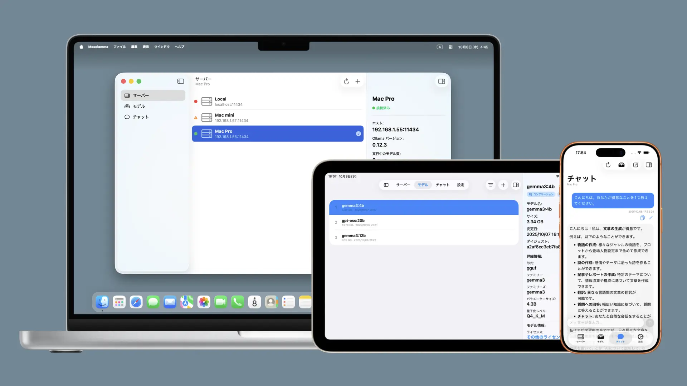
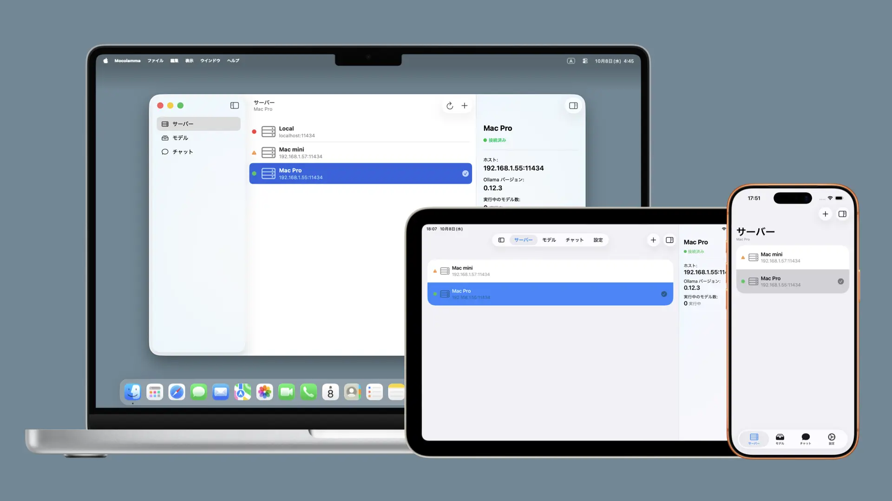
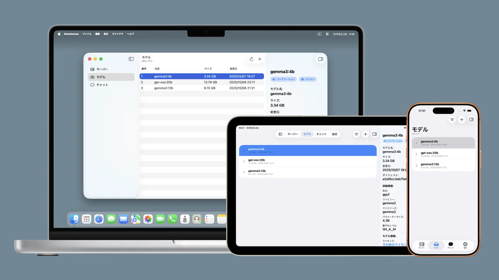
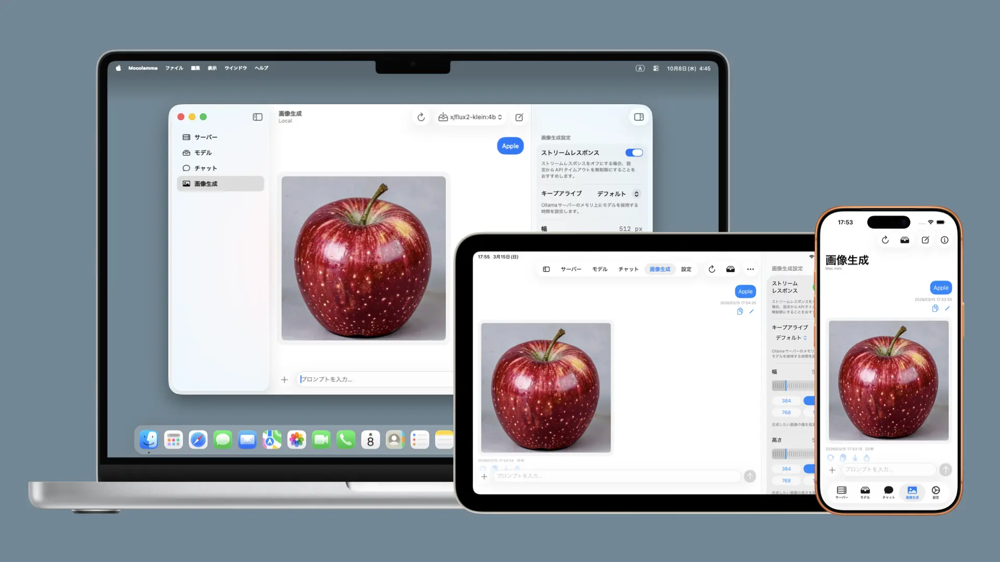

# Mocolamma
[English](/README.md) | **日本語**

  
  &nbsp;
  
  &nbsp;
  

  

## 目次
- [Mocolammaとは？](#mocolammaとは)
  - [名前の由来](#名前の由来)
  - [ダウンロード](#ダウンロード)
    - [macOS版](#macos版)
    - [iOS / iPadOS版](#ios--ipados版)
    - [visionOS版](#visionos版)
  - [システム要件](#システム要件)
  - [無料版と有料版の違い](#無料版と有料版の違い)
- [機能](#機能)
  - [サーバータブ](#サーバータブ)
  - [モデルタブ](#モデルタブ)
  - [チャットタブ](#チャットタブ)
  - [画像生成タブ](#画像生成タブ)
  - [プライバシーとセキュリティ](#プライバシーとセキュリティ)
  - [App Storeレビューリクエストについて](#app-storeレビューリクエストについて)
- [サポートとフィードバック](#サポートとフィードバック)
  - [バグ報告](#バグ報告)
  - [フィードバック](#フィードバック)
  - [コミュニティ](#コミュニティ)
- [開発者をサポート](#開発者をサポート)
  - [スターをつける](#スターをつける)
  - [寄付](#寄付)
- [クレジット](#クレジット)
  - [Ollama by Ollama](#ollama-by-ollama)
  - [Antigravity と Gemini CLI by Google / Qwen Code by Qwen / OpenCode by Anomaly](#antigravity-と-gemini-cli-by-google--qwen-code-by-qwen--opencode-by-anomaly)
  - [Textual by Guillermo Gonzalez and Taiga Imaura](#textual-by-guillermo-gonzalez-and-taiga-imaura)
  - [CompactSlider by Alexey Bukhtin](#compactslider-by-alexey-bukhtin)
  - [create-dmg by Andrey Tarantsov and Andrew Janke](#create-dmg-by-andrey-tarantsov-and-andrew-janke)

## Mocolammaとは？

Mocolammaは、macOS、iOS / iPadOSおよびvisionOS用の[**Ollama**](https://github.com/ollama/ollama)管理アプリケーションで、Ollamaサーバーに接続してモデルを管理したり、Ollamaサーバーに保存されているモデルを使ってチャットのテストを行ったりすることができます。

> [!NOTE]
> Mocolammaの開発には生成AIが活用されました。そのため、ベストプラクティスに沿っていなかったり、不安定なコードが含まれていたりする可能性があります。\
> MocolammaはOllamaの非公式アプリであり、Ollamaとは一切関係がありません。

### 名前の由来
「Mocolamma」の由来は、「**Mo**del」「**Co**ntrol」「Ol**lam**a」「**Ma**nage」を組み合わせた造語です。\
読みやすくて覚えやすく、かつ意味のある言葉にしたいと思って考えた結果、このような言葉が生まれました。

### ダウンロード
#### macOS版
Mocolammaは[**リリースページ**](https://github.com/taikun114/Mocolamma/releases/latest)から無料でダウンロードするか、[**Mac App Store**](https://apps.apple.com/jp/app/mocolamma/id6753896649)から250円で購入することができます。

#### iOS / iPadOS版
Mocolammaは[**App Store**](https://apps.apple.com/jp/app/mocolamma/id6753896649)から250円で購入することができます。

#### visionOS版
Mocolammaは[**App Store**](https://apps.apple.com/jp/app/mocolamma/id6753896649)から250円で購入することができます。

> [!TIP]
> macOSまたはiOS / iPadOS、visionOSのいずれかのApp StoreでMocolammaを購入すると、一度の購入ですべてのプラットフォームから利用可能になります！

### システム要件
Mocolammaのシステム要件は次の通りです。

- **macOS Sequoia（15.0）またはそれ以降**がインストールされたMac
  - **Intelプロセッサを搭載したMacとAppleシリコンを搭載したMac**に対応しています。
- **iOS / iPadOS 18.0またはそれ以降**がインストールされたiPhoneとiPad
- **visionOS 2.0またはそれ以降**がインストールされたApple Vision Pro

> [!NOTE]
> MocolammaにはOllamaは含まれていません。Mocolammaのほとんどの機能を使用するには別途Ollamaサーバーが必要です。\
> また、ローカルネットワーク内からアクセスできるようにOllamaサーバーを設定している必要があります。

### 無料版と有料版の違い
Mocolammaには無料版（GitHub版、Macのみ）と有料版（App Store版）がありますが、アプリの基本機能に違いはありません。App Store版には、自動アップデート機能のように、App Storeによって提供される機能がいくつか含まれています。\
それぞれの違いについては以下の通りです。

| 機能               | 無料版 (GitHub版) | 有料版 (App Store版)           |
|-------------------|------------------|-------------------------------|
| プラットフォーム     | macOS            | macOS、iOS / iPadOS、visionOS |
| 価格               | 無料              | 250円                         |
| アプリのすべての機能  | 〇               | 〇                            |
| 自動アップデート     | ×                | 〇 (App Storeの機能)           |
| 寄付リンク          | 〇               | × (App Storeの審査のため)       |
| レビューリクエスト   | ×                | 〇 (無効化可能)                 |
| 開発者へのサポート   | 〇 (寄付リンクから) | 〇 (購入から)                  |

私としてはApp Storeから購入してくださるとありがたいですが、まずは無料でダウンロードしてみて、とても便利だと思ったら購入したり[**寄付**](#寄付)したりしてくださると大変嬉しいです！

## 機能
Mocolammaは、ネットワーク上に存在するOllamaサーバーと接続して、モデルを管理したり、モデルを使って簡易的なチャットを行ったりすることができます。

### サーバータブ

サーバータブから簡単にOllamaサーバーを追加・編集などの管理を行うことができます。macOS版ではデフォルトでlocalhostサーバーが登録されるため、Mocolammaを開いたMacでOllamaサーバーを実行している場合は、サーバーの追加設定を行うことなくすぐに使い始めることができます。

### モデルタブ

モデルタブから選択されているサーバーに保存されたモデルを確認したり、選択されているサーバーにモデルを追加したりすることができます。インスペクタを開けば特定のモデルの詳細情報を確認することもできます。

### チャットタブ

チャットタブでは選択されているサーバーに保存されたモデルを使って簡易的なチャットを行うことができます。あくまでモデルのテストとして使える簡易的なチャットですので、メッセージの保存機能はありませんが、ダウンロードしたモデルを気軽にテストするときに便利です。\
高度なチャットを行いたい場合はOllama公式アプリを使うか、チャットに特化した専用のアプリを使用することをおすすめします。

### 画像生成タブ

画像生成タブでは選択されているサーバーに保存された画像モデルを使って画像生成を行うことができます。生成された画像をデバイス内に保存したり、共有したりすることもできます。

> [!NOTE]
> Ollamaの画像生成機能は現在ベータ版です。将来的なOllama APIの仕様変更などで機能しなくなる可能性があります。\
> また、2026年3月現在、Ollamaで画像生成機能を使用するには、OllamaサーバーとしてAppleシリコン搭載したMacを使用する必要があるようです。

### プライバシーとセキュリティ
Mocolammaは**ユーザーに関する情報は一切収集しません**。\
システム設定の「解析と改善」設定内にある「アプリデベロッパと共有」をオンにしているユーザーの使用状況データとクラッシュレポートが共有される場合がありますが、**アプリ自体には情報を収集して送信する機能は全く搭載されていません**。プライバシーが心配な方でも安心してお使いいただけます。

### App Storeレビューリクエストについて
App Store版では、定期的に（非常に低頻度で）ユーザーに、App Storeへのレビューを求める画面（レビューリクエスト画面）が表示されるようになっています。

この画面が表示されるのは、次の条件をすべて満たしている場合です。

- App Store版を使用していること
- 主要な機能を使用した回数であるアクション数が合計29回またはそれ以上であること
  - アクション数は以下の操作で増加します。
    - モデルのダウンロードが正常に開始されたとき
    - チャットを送信して最初の正常なレスポンスを受信したとき
    - 画像プロンプトを送信して最初の正常なレスポンスを受信したとき
- アプリをアップデートしてから（アップデート後に初めて起動してから）3日間経過していること
  - 初回インストールも含みます（初めて起動してから3日間経過）。
- 過去に同じバージョンでレビューリクエスト画面が1度も表示されていないこと
- 前回のレビューリクエスト画面表示から90日以上空いていること
- アプリの設定からレビューリクエストを無効化していないこと

アクション数は1日あたり最大10回までの増加となっているため、最短でも1日あたり10回以上のアクションを3日間続ける必要があります。そのため、アプリを使い始めてすぐの段階ではこの画面が表示されません（より正確なレビューを行えるようにするため）。

上記条件を満たしている場合、次のタイミングでレビューリクエスト画面が表示されます。

- モデルのダウンロードが正常に完了したとき
- チャットを送信したとき
- 画像プロンプトを送信したとき

## サポートとフィードバック
### バグ報告
Mocolammaは生成AIを活用して開発されたアプリです。開発中に何度もテストは行いましたが、それでもバグが残っていたり、一部機能が正常に動作しなかったりする場合があります。

バグや動作の問題を見つけた場合は、既に開かれている[**Issue**](https://github.com/taikun114/Mocolamma/issues)（既知のバグや問題）を確認し、他の方が報告している同じ問題がないか探してみてください。同じ問題が見つからなかった場合は新しいIssueを開き、問題の報告をお願いします。\
バグトラッキングを容易にするため、複数の問題を報告したい場合は1つの問題に対して1つのIssueを開いてください。つまり、2つのバグを報告したい場合は2つのIssueを開く必要があります。

### フィードバック
GitHubアカウントをお持ちでない方のバグ報告やアイデア共有、開発者（私）へのメッセージなど、フィードバックを送りたい場合は[**こちらのリンク**](mailto:contact.taikun@gmail.com?subject=Mocolamma%E3%81%AE%E3%83%95%E3%82%A3%E3%83%BC%E3%83%89%E3%83%90%E3%83%83%E3%82%AF%3A%20&body=%E3%83%95%E3%82%A3%E3%83%BC%E3%83%89%E3%83%90%E3%83%83%E3%82%AF%E5%86%85%E5%AE%B9%E3%82%92%E5%85%B7%E4%BD%93%E7%9A%84%E3%81%AB%E8%AA%AC%E6%98%8E%E3%81%97%E3%81%A6%E3%81%8F%E3%81%A0%E3%81%95%E3%81%84%3A%0D%0A%0D%0A%0D%0A%E3%82%B7%E3%82%B9%E3%83%86%E3%83%A0%E6%83%85%E5%A0%B1%3A%0D%0A%0D%0A%0D%0A%E3%83%BB%E3%82%B7%E3%82%B9%E3%83%86%E3%83%A0%0D%0A%E3%81%8A%E4%BD%BF%E3%81%84%E3%81%AEMac%20%2F%20iPhone%20%2F%20iPad%20%2F%20Apple%20Vision%20Pro%E3%81%AE%E6%A9%9F%E7%A8%AE%E3%82%92%E5%85%A5%E5%8A%9B%E3%81%97%E3%81%A6%E3%81%8F%E3%81%A0%E3%81%95%E3%81%84%E3%80%82%0D%0A%0D%0A%0D%0A%E3%83%BBOS%E3%83%90%E3%83%BC%E3%82%B8%E3%83%A7%E3%83%B3%0D%0A%E5%95%8F%E9%A1%8C%E3%81%8C%E8%B5%B7%E3%81%93%E3%81%A3%E3%81%A6%E3%81%84%E3%82%8B%E5%A0%B4%E5%90%88%E3%80%81Mocolamma%E3%82%92%E5%AE%9F%E8%A1%8C%E3%81%97%E3%81%A6%E3%81%84%E3%82%8BmacOS%20%2F%20iOS%20%2F%20iPadOS%20%2F%20visionOS%E3%81%AE%E3%83%90%E3%83%BC%E3%82%B8%E3%83%A7%E3%83%B3%E3%82%92%E5%85%A5%E5%8A%9B%E3%81%97%E3%81%A6%E3%81%8F%E3%81%A0%E3%81%95%E3%81%84%E3%80%82%0D%0A%0D%0A%0D%0A%E3%83%BB%E3%82%A2%E3%83%97%E3%83%AA%E3%83%90%E3%83%BC%E3%82%B8%E3%83%A7%E3%83%B3%0D%0A%E5%95%8F%E9%A1%8C%E3%81%8C%E8%B5%B7%E3%81%93%E3%81%A3%E3%81%A6%E3%81%84%E3%82%8B%E5%A0%B4%E5%90%88%E3%80%81%E3%82%A2%E3%83%97%E3%83%AA%E3%81%AE%E3%83%90%E3%83%BC%E3%82%B8%E3%83%A7%E3%83%B3%E3%82%92%E5%85%A5%E5%8A%9B%E3%81%97%E3%81%A6%E3%81%8F%E3%81%A0%E3%81%95%E3%81%84%E3%80%82%0D%0A%0D%0A)をクリックするか、アプリについての画面（macOSでは「Mocolammaについて」から、iOS / iPadOS / visionOSでは設定タブの情報ボタンから開く画面）にある「フィードバックを送信」ボタンからメールをお送りいただけます（すべてのメッセージに返信できるとは限りませんので、あらかじめご了承ください）。\
アプリ内のボタンからメールの送信画面を開くと、システム情報（デバイスの機種とOSのバージョン情報）やアプリのバージョン情報など、こちらで必要な情報が事前に入力された状態になるため、こちらから送信していただくことをおすすめします。

### コミュニティ
アプリに追加してほしい新機能の共有や、バグかどうかはわからないけど気になる問題など、質問したり他の人と意見交換したりなどが可能な[**ディスカッションページ**](https://github.com/taikun114/Mocolamma/discussions)が用意されています。\
情報交換の場として、ぜひご活用ください。私もよく覗いているので、開発者へのメッセージも大歓迎です！

## 開発者をサポート
### スターをつける
[**こちらのページ**](https://github.com/taikun114/Mocolamma)を開き、右上の「Star」ボタンをクリックしてスターをつけてくださるととてもうれしいです！\
このボタンは言わば高評価ボタンのようなもので、開発を続けるモチベーションになります！この機能は無料なので、Mocolammaを気に入ったらぜひスターをつけてください！

### 寄付
Mocolammaが気に入ったら寄付してくださると嬉しいです。開発を続けるモチベーションになります！

以下のサービスを使って寄付していただくことができます。

#### Buy Me a Coffee
[**Buy Me a Coffee**](https://www.buymeacoffee.com/i_am_taikun)で緑茶一杯分の金額からサポートしていただけます。

#### PayPal.Me
PayPalアカウントをお持ちの方は、[**PayPal**](https://paypal.me/taikun114)で直接寄付していただくこともできます。

## クレジット
### [Ollama](https://github.com/ollama/ollama) by Ollama
MocolammaはOllamaサーバーやモデルを管理・操作するために特化して作られたアプリです。OllamaがなければMocolammaが登場する事はなかったでしょう。

### [Antigravity](https://antigravity.google/) と [Gemini CLI](https://github.com/google-gemini/gemini-cli) by Google / [Qwen Code](https://github.com/QwenLM/qwen-code) by Qwen / [OpenCode](https://github.com/anomalyco/opencode) by Anomaly
Mocolammaの開発にはこれらの素晴らしい生成AIツールが使用されました。Swiftを含むプログラムの知識が一切ない自分にとって、生成AIの力がなければこのアプリを完成させることはできなかったでしょう。

### [Textual](https://github.com/taikun114/textual) by Guillermo Gonzalez and Taiga Imaura
チャット画面のMarkdownレンダリングの実装にはTextualパッケージが使用されました。このパッケージのおかげで、とても簡単に美しいMarkdownレンダリングを実装することができました。\
Mocolammaでは、[オリジナル版](https://github.com/gonzalezreal/textual)をもとにMocolammaに合わせて最適化されたカスタム版が使用されています。

### [CompactSlider](https://github.com/buh/CompactSlider) by Alexey Bukhtin
チャット設定の温度やコンテキストウィンドウのスライダーの実装にはCompactSliderパッケージが使用されました。このパッケージのおかげで、美しくカスタマイズされたスライダーを実装することができました。

### [create-dmg](https://github.com/create-dmg/create-dmg) by Andrey Tarantsov and Andrew Janke
無料版を配布するためのディスクイメージを作成するのにcreate-dmgシェルスクリプトが使用されました。このシェルスクリプトのおかげで、カスタマイズされたディスクイメージを簡単に作成することができました。