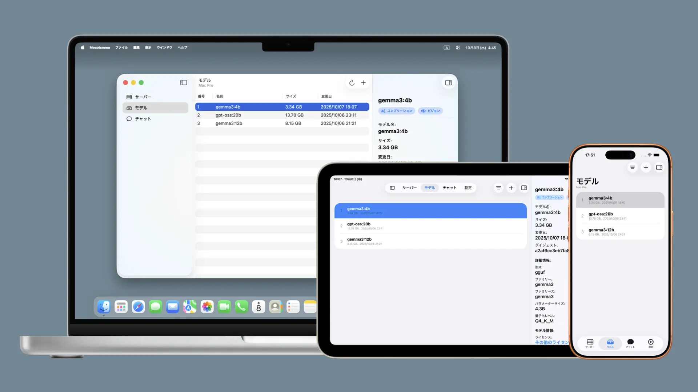

# Mocolamma
[English](/README.md) | **日本語**

  
  &nbsp;
  
  &nbsp;
  

  

## 目次
- [Mocolammaとは？](#mocolammaとは)
  - [名前の由来](#名前の由来)
  - [ダウンロード](#ダウンロード)
    - [macOS版](#macos版)
    - [iOS / iPadOS版](#ios--ipados版)
  - [システム要件](#システム要件)
  - [無料版と有料版の違い](#無料版と有料版の違い)
- [機能](#機能)
  - [サーバータブ](#サーバータブ)
  - [モデルタブ](#モデルタブ)
  - [チャットタブ](#チャットタブ)
  - [プライバシーとセキュリティ](#プライバシーとセキュリティ)
- [サポートとフィードバック](#サポートとフィードバック)
  - [バグ報告](#バグ報告)
  - [フィードバック](#フィードバック)
  - [コミュニティ](#コミュニティ)
- [開発者をサポート](#開発者をサポート)
  - [スターをつける](#スターをつける)
  - [寄付](#寄付)
- [クレジット](#クレジット)
  - [Ollama by Ollama](#ollama-by-ollama)
  - [Gemini CLI by Google / Qwen Code by Qwen / opencode by SST](#gemini-cli-by-google--qwen-code-by-qwen--opencode-by-sst)
  - [MarkdownUI by Guillermo Gonzalez](#markdownui-by-guillermo-gonzalez)
  - [CompactSlider by Alexey Bukhtin](#compactslider-by-alexey-bukhtin)
  - [create-dmg by Andrey Tarantsov and Andrew Janke](#create-dmg-by-andrey-tarantsov-and-andrew-janke)

## Mocolammaとは？

Mocolammaは、macOSおよびiOS / iPadOS用の[**Ollama**](https://github.com/ollama/ollama)管理アプリケーションで、Ollamaサーバーに接続してモデルを管理したり、Ollamaサーバーに保存されているモデルを使ってチャットのテストを行ったりすることができます。

> [!NOTE]
> Mocolammaの開発には生成AIが活用されました。そのため、ベストプラクティスに沿っていなかったり、不安定なコードが含まれていたりする可能性があります。\
> MocolammaはOllamaの非公式アプリであり、Ollamaとは一切関係がありません。

### 名前の由来
「Mocolamma」の由来は、「**Mo**del」「**Co**ntrol」「Ol**lam**a」「**Ma**nage」を組み合わせた造語です。\
読みやすくて覚えやすく、かつ意味のある言葉にしたいと思って考えた結果、このような言葉が生まれました。

### ダウンロード
#### macOS版
Mocolammaは[**リリースページ**](https://github.com/taikun114/Mocolamma/releases/latest)から無料でダウンロードするか、**Mac App Storeから250円で購入する**ことができます（App Storeのリンクは現在準備中です）。

#### iOS / iPadOS版
Mocolammaは**App Storeから250円で購入する**ことができます（App Storeのリンクは現在準備中です）。

> [!TIP]
> macOSまたはiOS / iPadOS、visionOSのいずれかのApp StoreでMocolammaを購入すると、一度の購入ですべてのプラットフォームから利用可能になります！

### システム要件
Mocolammaは、**macOS Sonoma（14.0）またはそれ以降**がインストールされている**Intelプロセッサを搭載したMac**と**Appleシリコンを搭載したMac**、**iOS / iPadOS 17.0またはそれ以降**がインストールされている**iPhoneやiPad**および、iPadアプリとして**visionOS 2.0またはそれ以降**がインストールされた**Apple Vision Pro**に対応しています。

> [!NOTE]
> 私はApple Vision Proを持っておらず、シミュレーターを使ったテストのみで実機を使ったテストができていないため、visionOSでは意図しない動作を引き起こす可能性があります。\
> 私の開発環境では、visionOS 1.Xのシミュレーターをインストールして正しく設定されているにもかかわらず、シミュレーターのデバイス一覧に表示されないため、visionOS 1.XでMocolammaが動作するか確認できていません。\
> Mocolammaの開発設定ではvisionOS 1.Xでも対応しているはずですので、visionOS 1.XでもMocolammaをインストールできるとは思うのですが、シミュレーターでテストすることができていないため、インストールできたとしても正しく動作しない可能性があります。

### 無料版と有料版の違い
Mocolammaには無料版（GitHub版、Macのみ）と有料版（App Store版）がありますが、どちらもほとんど機能の違いはありません。**唯一の違いは自動アップデート機能の有無**です。\
有料版ではApp Storeの機能でアップデートとインストールを自動で行うことができますが、無料版では今のところアップデート確認機能とインストール機能は搭載されていません（つまり、アプリの機能としては何一つ変わりません！）。

私としてはApp Storeから購入してくださるとありがたいですが、まずは無料でダウンロードしてみて、とても便利だと思ったら購入したり[**寄付**](#寄付)したりしてくださると大変嬉しいです！

## 機能
Mocolammaは、ネットワーク上に存在するOllamaサーバーと接続して、モデルを管理したり、モデルを使って簡易的なチャットを行ったりすることができます。

### サーバータブ

サーバータブから簡単にOllamaサーバーを追加・編集などの管理を行うことができます。macOS版ではデフォルトでlocalhostサーバーが登録されるため、Mocolammaを開いたMacでOllamaサーバーを実行している場合は、サーバーの追加設定を行うことなくすぐに使い始めることができます。

### モデルタブ

モデルタブから選択されているサーバーに保存されたモデルを確認したり、選択されているサーバーにモデルを追加したりすることができます。インスペクタを開けば特定のモデルの詳細情報を確認することもできます。

### チャットタブ

チャットタブでは選択されているサーバーに保存されたモデルを使って簡易的なチャットを行うことができます。あくまでモデルのテストとして使える簡易的なチャットですので、メッセージの保存機能や細かなパラメーター設定などを行うことはできませんが、ダウンロードしたモデルを気軽にテストするときに便利です。\
高度なチャットを行いたい場合はOllama公式アプリを使うか、チャットに特化した専用のアプリを使用することをおすすめします。

### プライバシーとセキュリティ
Mocolammaは**ユーザーに関する情報は一切収集しません**。\
システム設定の「解析と改善」設定内にある「アプリデベロッパと共有」をオンにしているユーザーの使用状況データとクラッシュレポートが共有される場合がありますが、**アプリ自体には情報を収集して送信する機能は全く搭載されていません**。プライバシーが心配な方でも安心してお使いいただけます。

## サポートとフィードバック
### バグ報告
Mocolammaは生成AIを活用して開発されたアプリです。開発中に何度もテストは行いましたが、それでもバグが残っていたり、一部機能が正常に動作しなかったりする場合があります。

バグや動作の問題を見つけた場合は、既に開かれている[**Issue**](https://github.com/taikun114/Mocolamma/issues)（既知のバグや問題）を確認し、他の方が報告している同じ問題がないか探してみてください。同じ問題が見つからなかった場合は新しいIssueを開き、問題の報告をお願いします。\
バグトラッキングを容易にするため、複数の問題を報告したい場合は1つの問題に対して1つのIssueを開いてください。つまり、2つのバグを報告したい場合は2つのIssueを開く必要があります。

### フィードバック
GitHubアカウントをお持ちでない方のバグ報告やアイデア共有、開発者（私）へのメッセージなど、フィードバックを送りたい場合は[**こちらのリンク**](mailto:contact.taikun@gmail.com?subject=Mocolamma%E3%81%AE%E3%83%95%E3%82%A3%E3%83%BC%E3%83%89%E3%83%90%E3%83%83%E3%82%AF%3A%20&body=%E3%83%95%E3%82%A3%E3%83%BC%E3%83%89%E3%83%90%E3%83%83%E3%82%AF%E5%86%85%E5%AE%B9%E3%82%92%E5%85%B7%E4%BD%93%E7%9A%84%E3%81%AB%E8%AA%AC%E6%98%8E%E3%81%97%E3%81%A6%E3%81%8F%E3%81%A0%E3%81%95%E3%81%84%3A%0D%0A%0D%0A%0D%0A%E3%82%B7%E3%82%B9%E3%83%86%E3%83%A0%E6%83%85%E5%A0%B1%3A%0D%0A%0D%0A%0D%0A%E3%83%BB%E3%82%B7%E3%82%B9%E3%83%86%E3%83%A0%0D%0A%E3%81%8A%E4%BD%BF%E3%81%84%E3%81%AEMac%20%2F%20iPhone%20%2F%20iPad%20%2F%20Apple%20Vision%20Pro%E3%81%AE%E6%A9%9F%E7%A8%AE%E3%82%92%E5%85%A5%E5%8A%9B%E3%81%97%E3%81%A6%E3%81%8F%E3%81%A0%E3%81%95%E3%81%84%E3%80%82%0D%0A%0D%0A%0D%0A%E3%83%BBOS%E3%83%90%E3%83%BC%E3%82%B8%E3%83%A7%E3%83%B3%0D%0A%E5%95%8F%E9%A1%8C%E3%81%8C%E8%B5%B7%E3%81%93%E3%81%A3%E3%81%A6%E3%81%84%E3%82%8B%E5%A0%B4%E5%90%88%E3%80%81Mocolamma%E3%82%92%E5%AE%9F%E8%A1%8C%E3%81%97%E3%81%A6%E3%81%84%E3%82%8BmacOS%20%2F%20iOS%20%2F%20iPadOS%20%2F%20visionOS%E3%81%AE%E3%83%90%E3%83%BC%E3%82%B8%E3%83%A7%E3%83%B3%E3%82%92%E5%85%A5%E5%8A%9B%E3%81%97%E3%81%A6%E3%81%8F%E3%81%A0%E3%81%95%E3%81%84%E3%80%82%0D%0A%0D%0A%0D%0A%E3%83%BB%E3%82%A2%E3%83%97%E3%83%AA%E3%83%90%E3%83%BC%E3%82%B8%E3%83%A7%E3%83%B3%0D%0A%E5%95%8F%E9%A1%8C%E3%81%8C%E8%B5%B7%E3%81%93%E3%81%A3%E3%81%A6%E3%81%84%E3%82%8B%E5%A0%B4%E5%90%88%E3%80%81%E3%82%A2%E3%83%97%E3%83%AA%E3%81%AE%E3%83%90%E3%83%BC%E3%82%B8%E3%83%A7%E3%83%B3%E3%82%92%E5%85%A5%E5%8A%9B%E3%81%97%E3%81%A6%E3%81%8F%E3%81%A0%E3%81%95%E3%81%84%E3%80%82%0D%0A%0D%0A)をクリックするか、アプリについての画面（macOSでは「Mocolammaについて」から、iOS / iPadOS / visionOSでは設定タブの情報ボタンから開く画面）にある「フィードバックを送信」ボタンからメールをお送りいただけます（すべてのメッセージに返信できるとは限りませんので、あらかじめご了承ください）。\
アプリ内のボタンからメールの送信画面を開くと、システム情報（デバイスの機種とOSのバージョン情報）やアプリのバージョン情報など、こちらで必要な情報が事前に入力された状態になるため、こちらから送信していただくことをおすすめします。

### コミュニティ
アプリに追加してほしい新機能の共有や、バグかどうかはわからないけど気になる問題など、質問したり他の人と意見交換したりなどが可能な[**ディスカッションページ**](https://github.com/taikun114/Mocolamma/discussions)が用意されています。\
情報交換の場として、ぜひご活用ください。私もよく覗いているので、開発者へのメッセージも大歓迎です！

## 開発者をサポート
### スターをつける
[**こちらのページ**](https://github.com/taikun114/Mocolamma)を開き、右上の「Star」ボタンをクリックしてスターをつけてくださるととてもうれしいです！\
このボタンは言わば高評価ボタンのようなもので、開発を続けるモチベーションになります！この機能は無料なので、Mocolammaを気に入ったらぜひスターをつけてください！

### 寄付
Mocolammaが気に入ったら寄付してくださると嬉しいです。開発を続けるモチベーションになります！

以下のサービスを使って寄付していただくことができます。

#### Buy Me a Coffee
[**Buy Me a Coffee**](https://www.buymeacoffee.com/i_am_taikun)で緑茶一杯分の金額からサポートしていただけます。

#### PayPal.Me
PayPalアカウントをお持ちの方は、[**PayPal**](https://paypal.me/taikun114)で直接寄付していただくこともできます。

## クレジット
### [Ollama](https://github.com/ollama/ollama) by Ollama
MocolammaはOllamaサーバーやモデルを管理・操作するために特化して作られたアプリです。OllamaがなければMocolammaが登場する事はなかったでしょう。

### [Gemini CLI](https://github.com/google-gemini/gemini-cli) by Google / [Qwen Code](https://github.com/QwenLM/qwen-code) by Qwen / [opencode](https://github.com/sst/opencode) by SST
Mocolammaの開発にはこれらの素晴らしい生成AIツールが使用されました。Swiftを含むプログラムの知識が一切ない自分にとって、生成AIの力がなければこのアプリを完成させることはできなかったでしょう。

### [MarkdownUI](https://github.com/gonzalezreal/swift-markdown-ui/tree/main) by Guillermo Gonzalez
チャット画面のMarkdownレンダリングの実装にはMarkdownUIパッケージが使用されました。このパッケージのおかげで、とても簡単に美しいMarkdownレンダリングを実装することができました。

### [CompactSlider](https://github.com/buh/CompactSlider) by Alexey Bukhtin
チャット設定の温度やコンテキストウィンドウのスライダーの実装にはCompactSliderパッケージが使用されました。このパッケージのおかげで、美しくカスタマイズされたスライダーを実装することができました。

### [create-dmg](https://github.com/create-dmg/create-dmg) by Andrey Tarantsov and Andrew Janke
無料版を配布するためのディスクイメージを作成するのにcreate-dmgシェルスクリプトが使用されました。このシェルスクリプトのおかげで、カスタマイズされたディスクイメージを簡単に作成することができました。